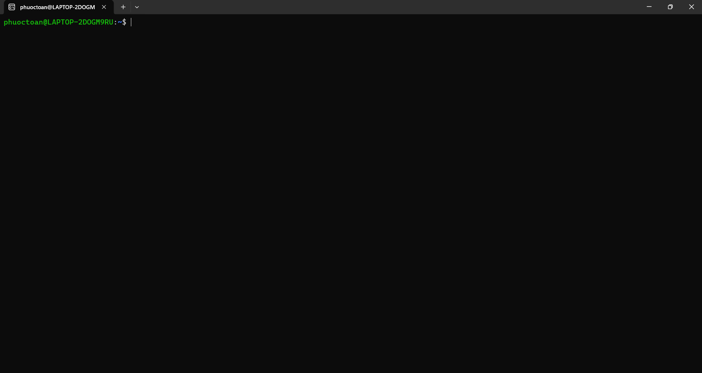

# Full Stack To-Do

### Backend - `server`

- NestJS 9
- REST API kèm tài liệu Swagger
- Hỗ trợ xác thực JWT
- TypeORM hỗ trợ nhiều loại cơ sở dữ liệu khác nhau

### Frontend - `client`

- Angular 16
- Đăng ký/đăng nhập người dùng
- Giao diện không lưu trữ trạng thái (stateless UI)
- Tích hợp Storybook để phát triển component
- Thư viện thiết kế (Design Library) tự xây dựng
- Quản lý trạng thái theo module (chuyển đổi qua `InjectionTokens`)

### Testing

- Jest cho unit test backend, và `supertest` cho integration test
- Jest cho unit test Angular
- Cypress + Storybook cho UI integration test

### Khác

- Manifest Kubernetes để triển khai lên cluster
- Dockerfile cho chạy độc lập và hỗ trợ `docker-compose`
- GitHub Actions dùng cho toàn bộ việc test, build và release
- Monorepo Nx v16 cho cấu trúc thư mục gọn gàng và Nx Cloud cho các tác vụ CI phân tán

## Biến môi trường

Để chạy dự án, bạn cần copy file `.env.sample` trong thư mục gốc, đổi tên thành `.env` và điền các giá trị tương ứng:

| Biến                          | Mô tả/Giá trị                                                          |
| ----------------------------- | ---------------------------------------------------------------------- |
| `DATABASE_TYPE`               | Truyền cho TypeORM, hỗ trợ hầu hết các DB quan hệ phổ biến             |
| `DATABASE_HOST`               | Không cần nếu dùng SQLite, có thể dùng với DB từ xa hoặc Docker cục bộ |
| `DATABASE_PORT`               |                                                                        |
| `DATABASE_USERNAME`           |                                                                        |
| `DATABASE_PASSWORD`           |                                                                        |
| `DATABASE_NAME`               |                                                                        |
| `DATABASE_PATH`               | Chỉ dùng với SQLite cho đường dẫn file tương đối                       |
| `JWT_SECRET`                  | Chuỗi dùng để ký JWT do API sinh ra                                    |
| `JWT_ACCESS_TOKEN_EXPIRES_IN` | Thời gian (giây) token có hiệu lực                                     |

## Chạy local

Vào thư mục dự án

```bash
  cd full-stack-todo
```

Cài đặt dependencies

```bash
  npm install
```

Thiết lập file môi trường

```bash
  cp .env.sample .env
```

Khởi chạy server

```bash
  npx nx run-many --target=serve --all
```

## Chạy Tests

Để chạy test, sử dụng lệnh sau

```bash
  # cho unit tests
  npx nx run-many --target=test --all --codeCoverage

  # cho E2E tests
  npx nx run-many --target=e2e --all
```

"# devOps-26-10"
"# devOps-26-10" 


## ảnh cài ubuntu

